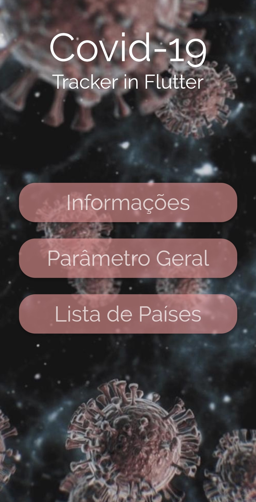
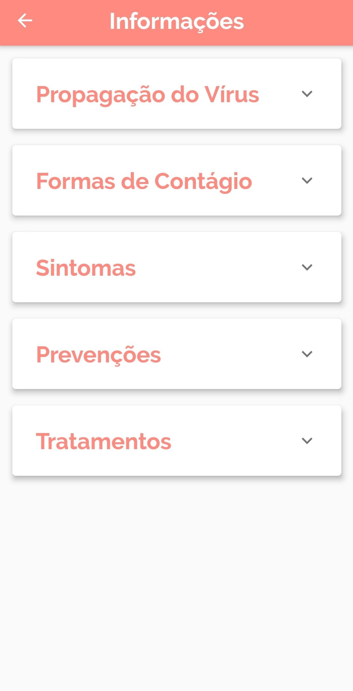
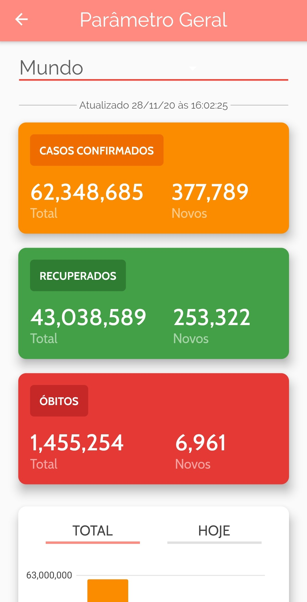
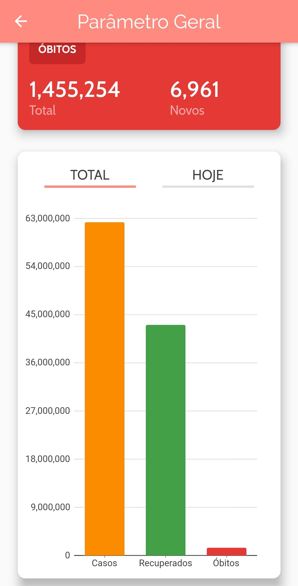
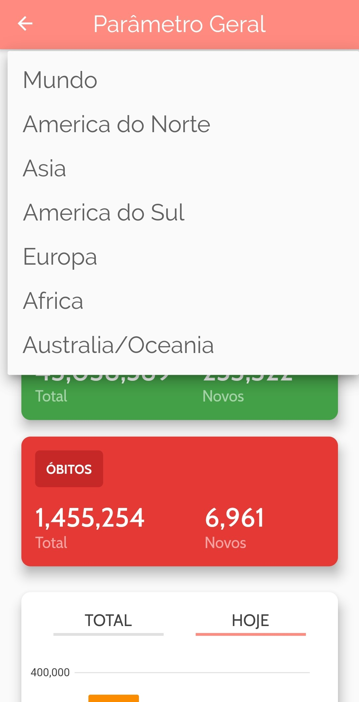
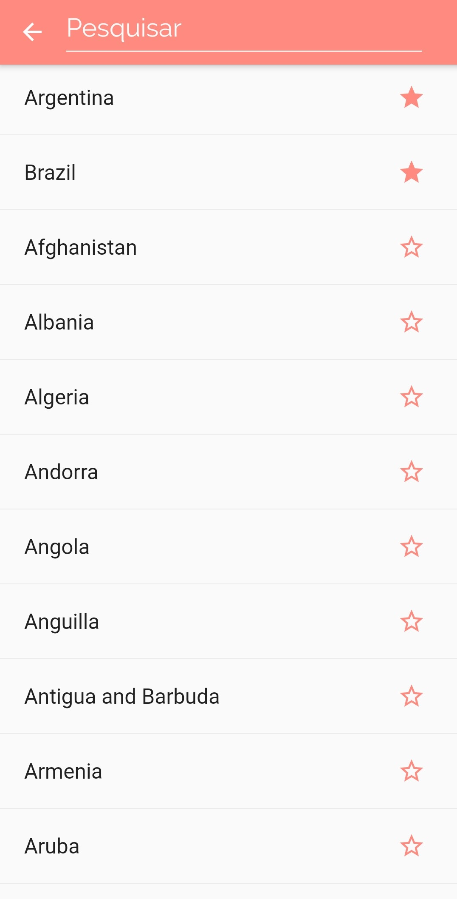
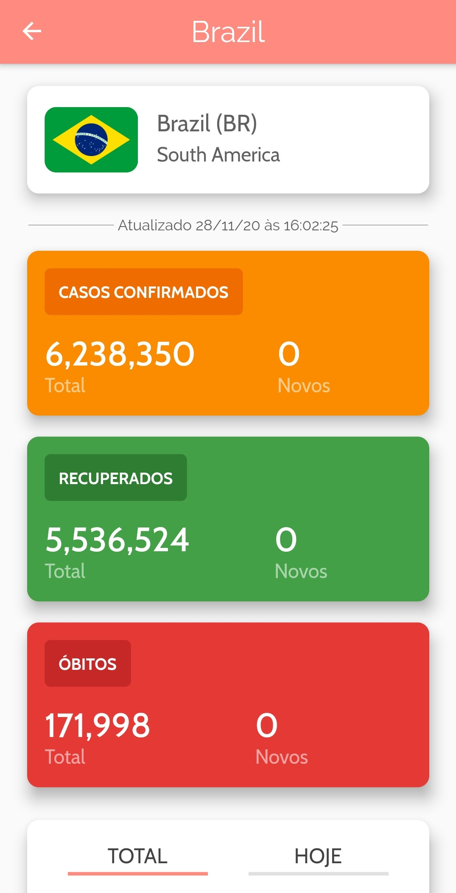
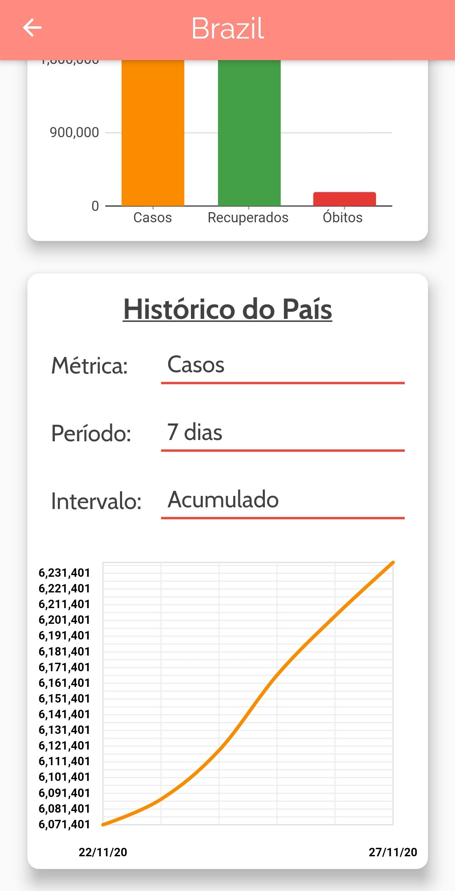
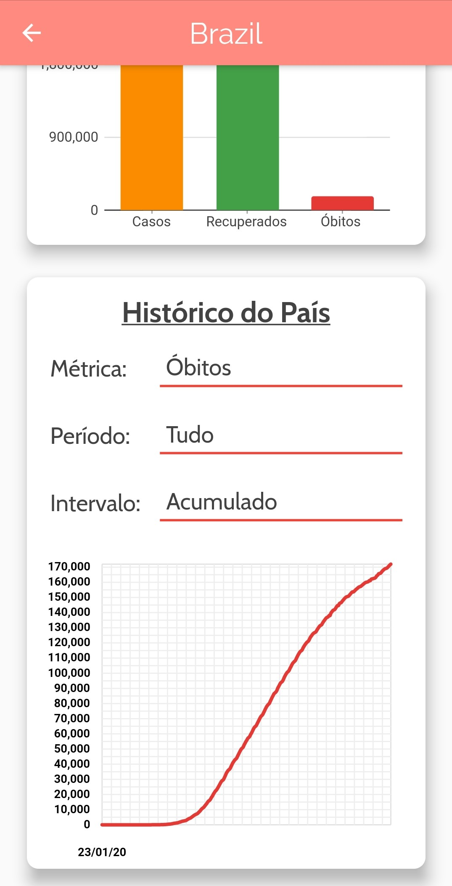

# Rastreador de casos do Covid-19 em Flutter.

Projeto produzido pelos alunos [Michel Hanzen Scheeren](https://github.com/MichelHanzenScheeren) e [Maria Vitória Reiter Grandi](https://github.com/mariagrandi) como parte da complementação de carga horária da disciplina de Desenvolvimento de Aplicações para Dispositivos Móveis do 5º período do Curso de Ciência da Computação, da Universidade Tecnológica Federal do Paraná - UTFPR Medianeira, sob a orientação do professor [Everton Coimbra de Araújo](https://github.com/evertonfoz).

O aplicativo foi desenvolvido utilizando o Flutter (versão 1.23.0), o UI toolkit para desenvolvimento híbrido do Google. Foram utilizadas ao longo do desenvolvimento as IDEs Visual Studio Code (v1.51.1) e o Android Studio (v4.1.1).

## Começando
Para utilizar o aplicativo, algumas ferramentas serão necessárias:
* [SDK flutter](https://flutter.dev/docs/get-started/install): Necessário para obtenção de pacotes e compilação do código para o ambiente nativo;
* [Android Studio](https://developer.android.com/studio): Flutter depende de uma instalação completa das dependências do Androis Studio para funcionar;
* Um emulador ou dispositivo físico para executar a aplicação;
  * Se preferir um emulador, pode usar o do próprio Adroid Studio: [Android Emulator](https://developer.android.com/studio/run/emulator?hl=pt-br);
  * Se for utilizar o seu dispositivo, [esse tutorial pode ser útil](https://developer.android.com/studio/run/device?hl=pt-br).

## Executando
* [Clone o repositório](https://github.com/MichelHanzenScheeren/covid19_tracker_in_flutter.git) do projeto ou [baixe o arquivo zip](https://github.com/MichelHanzenScheeren/covid19_tracker_in_flutter/archive/master.zip);
* Abra-o projeto com o editor de código que preferir (Visual Code recomendado) ou no prompt de comandos do seu computador (caminho_completo\covid19_tracker_in_flutter-master);
* Se ainda não tiver inicializado o emulador ou conectado seu celular (em modo de depuração) ao computador, faça isso;
* Se o visual Studio Code ou o Android Studio solicitarem permissão para baixar "arquivos faltando", permita;
* Execute a aplicação (F5 ou comando "flutter run" no prompt de comando - com o cmd aberto na pasta do projeto).

## Funcionalidades
* Informações gerais sobre o Covid-19:
  * Formas de propagação;
  * Formas de Contágio;
  * Sintomas;
  * Prevenção;
  * Tratamento;
* Panorama geral sobre o Covid-19 pelo mundo:
  * Cards com casos confirmados, recuperados e óbitos do dia atual e o acumulado total desde o início da pandemia;
  * Opção de filtrar por cada continente ou sobre o mundo todo;
  * Gráfico de barras para facilitar a visualização dos dados;
 * Lista de Países afetados pelo Covid-19;
 * Opção para salvar 'países favoritos' da lista;
 * Opção para pesquisar países;
 * Situação da pandemia em cada país:
  * Cards com casos confirmados, recuperados e óbitos do dia atual e o acumulado total desde o início da pandemia;
  * Gráfico de barras para facilitar a visualização dos dados;
  * Gráfico de linha com histórico completo do país, permitindo filtrar:
    * A métrica (casos, recuperados ou óbitos);
    * O Período (7 dias, 30 dias, 3 meses, 6 meses ou todo o período);
    * Intervalo de dados (Valor acumulado ou diário);

## Imagens
<table>
  <tr>
   <td align="center">Página Inicial</td>
   <td align="center">Página de informações</td>
   <td align="center">Card com informação</td>
  </tr>
  <tr>
   <td></td>
   <td></td>
   <td></td>
  </tr>
 </table>
 
 <table>
  <tr>
   <td align="center">Informações Gerais</td>
   <td align="center">Gráfico de Barras</td>
   <td align="center">Opções Disponíveis</td>
  </tr>
  <tr>
   <td></td>
   <td></td>
   <td></td>
  </tr>
 </table>
 
 <table>
  <tr>
   <td align="center">Lista de Países</td>
   <td align="center">Resumo de um País</td>
   <td colspan="2" align="center">Histórico</td>
  </tr>
  <tr>
   <td></td>
   <td></td>
   <td></td>
   <td></td>
  </tr>
 </table>
